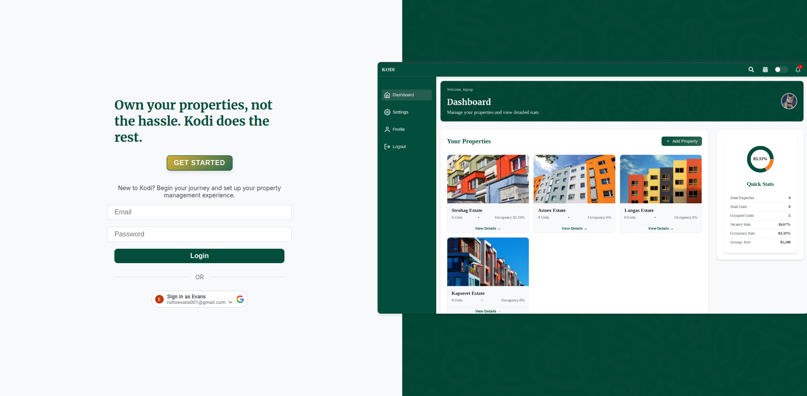
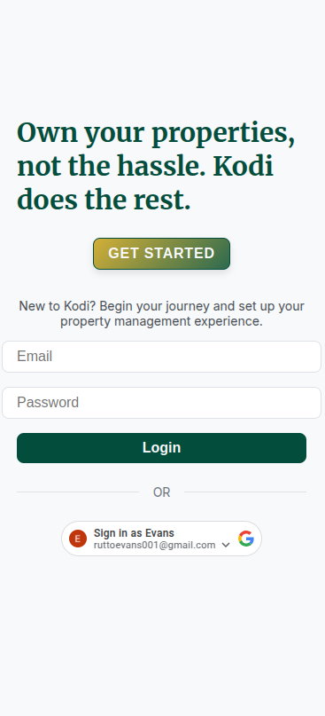

# 🏠 Kodi Property Manager

A modern **Property & Tenant Management Progressive Web App (PWA)** built with **React, Vite, Redux, Ruby on Rails, and Cloudflare Pages**.  
Designed to help property managers manage houses, tenants, payments, and notifications in real-time — both on **Web** and **Mobile (PWA)**.

---

## 🚀 Tech Stack

### 🖥️ Frontend – React PWA
- **React + TypeScript**
- **Vite** (Fast build tooling)
- **Redux Toolkit** (State management)
- **React Router**
- **Styled Components** (Component styling)
- **Firebase Cloud Messaging** (Push Notifications)
- **vite-plugin-pwa** (PWA capabilities: Offline access, background sync, version updates)

#### 📂 Folder Structure

/web
├── public/                # Static assets (logos, images)
├── src/
│   ├── components/        # Reusable UI components (Navbar, Sidebar, Toast, Modals)
│   ├── containers/        # High-level data containers
│   ├── redux/             # Redux slices, hooks & store setup
│   ├── hooks/             # Custom React hooks (PWA updates, Notifications)
│   ├── Router/            # React Router configuration
│   ├── styles/            # Global styles & theme colors
│   ├── App.tsx            # Main App component
│   ├── main.tsx           # App entry point
│   └── vite.config.ts     # Vite + PWA configuration


---

### 💾 Backend – Ruby on Rails API
- **Ruby on Rails 7 API**
- **PostgreSQL** Database
- **ActionCable** (Real-time notifications)
- **Service Objects & Background Jobs**
- **SMS + Payment Services** (integrated with external services)
- **Standard Rails conventions**

#### 📂 Folder Structure

/server
├── app/
│   ├── controllers/       # API Controllers (admins, properties, payments, tenants)
│   ├── models/            # ActiveRecord Models
│   ├── services/          # Payment & Notification Service Objects
│   ├── jobs/              # Background Jobs (SMS, Payments)
│   └── channels/          # ActionCable channels
├── config/                # Rails configurations & routes
├── db/                    # Migrations & seeds
├── Dockerfile             # Containerization setup
└── Gemfile                # Ruby dependencies


---

## 🌐 Live Demo

**Frontend (PWA):**  
[https://kodi-2ti.pages.dev](https://kodi-2ti.pages.dev)

**Backend API (Render):**  
[https://kodi-rails-server.onrender.com](https://kodi-rails-server.onrender.com)

---

## 📸 App Preview

### 🖥️ Desktop View



### 📱 Mobile View



> Place your screenshots in:  
> `/web/public/kodi-desktop-preview.png`  
> `/web/public/kodi-mobile-preview.png`

---

## 🛠️ How to Run Locally

### 🖥️ Frontend – React PWA

1. Go to the frontend directory:
```bash
cd web


1. Install dependencies:

```npm install```

2. Run the development server:


```npm run dev```

The app will be available at: http://localhost:5173

Backend – Rails API

Go to the server directory:


```cd server```

Install Ruby gems:


```bundle install```

Setup the database:


```bundle exec rails db:create db:migrate db:seed```


Run the server:


```bundle exec rails server -b 0.0.0.0 -p 3000```

The API will be available at:
http://localhost:3000

🚀 Production Deployment Workflow
This project uses a GitHub Actions CI/CD pipeline for automated deployments.

Every time you push to the main branch:

✅ Backend API is deployed to Render.com

✅ Frontend PWA is built and deployed to Cloudflare Pages

✅ PWA users receive instant updates and a version refresh notification

You can also manually trigger deployment via:
GitHub → Actions → Deploy Kodi App → Run Workflow

🔔 PWA Update Notifications
When a new version of the app is deployed:

Users will see a banner at the bottom:

🔄 New version available. [Refresh]

Clicking Refresh will instantly load the latest version without the need to clear browser cache.

👥 Contributors
@robbyevans – Creator & Maintainer

📝 License
This project is open-source and available under the MIT License.

🙌 Acknowledgements
React

Ruby on Rails

Cloudflare Pages

Render.com

vite-plugin-pwa

Firebase Cloud Messaging